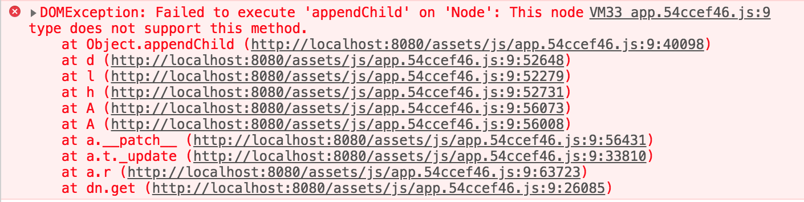

# vuepress-ssr-mismatch-repro 

> Reproduction of https://github.com/vuejs/vuepress/issues/1382

## Step to reproduce

1. yarn install
2. yarn serve:before
3. Visit `http://localhost:8080/foo`, open the console you'll see:



4. Refresh the browser, the page renders well.

For more details of this issue, please head [vuepress/issues/1382](https://github.com/vuejs/vuepress/issues/1382).

## How to fix it?

For now you can use the [vuepress-plugin-ssr-mismatch-workaround](https://github.com/Shigma/vuepress-plugin-ssr-mismatch-workaround) created by VuePress's collabrator [@Shigma](https://github.com/Shigma):

```bash
yarn add vuepress-plugin-ssr-mismatch-workaround -D
```

```js
// .vuepress/config.js
module.exports = {
  plugins: [
    ['ssr-mismatch-workaround']
  ]
}
```

We've prepared a example at this repo, you can test it with running `yarn serve:after` and repeating above steps, you'll find that the page works well.


